# iPhone App Icons

  <kbd>
    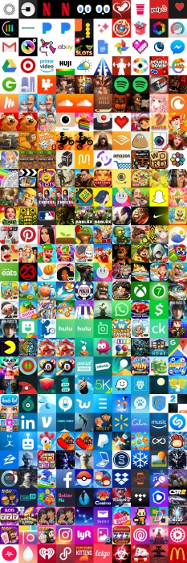
  </kbd>

Repo for playing around with App Store app icons. Current scripts in repo:
* `download_top_chart_icons.py`: script to download top chart app icons (**output in [icons dir](/icons)**)
* `sort_icons_by_color.py`: script to sort app icons by hsv color space (**output shown above**)
* `icon_cluster_color_kmeans.py`: cluster app icons (currently clustering solely by color, plan to add keypoint features; **output shown below**)

## K means results with `k=10`*
\*(color histogram features only)

  <kbd>
    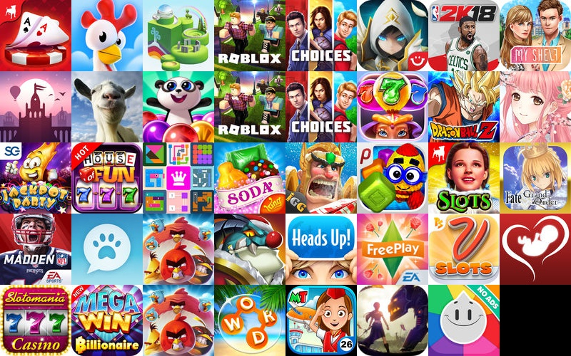
  </kbd>
  <kbd>
    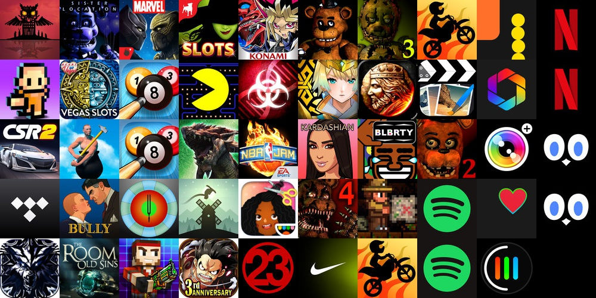
  </kbd>
  <kbd>
    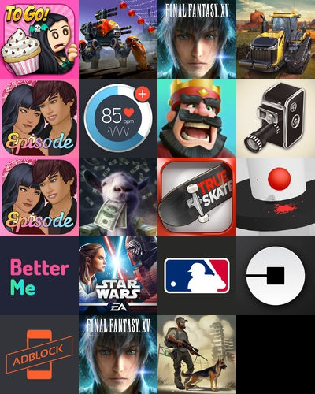
  </kbd>
  <kbd>
    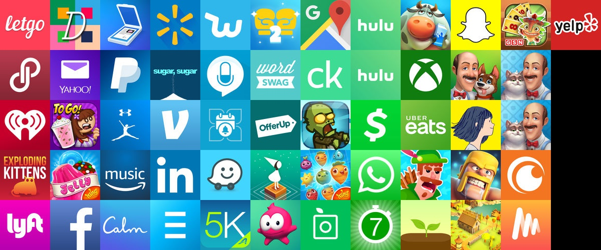
  </kbd>
  <kbd>
    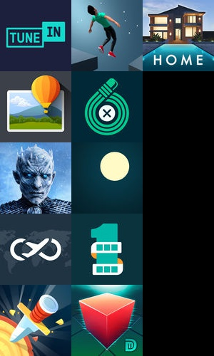
  </kbd>
  <kbd>
    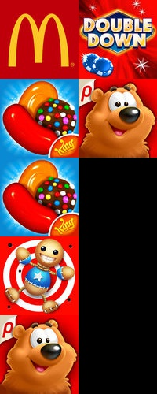
  </kbd>
  <kbd>
    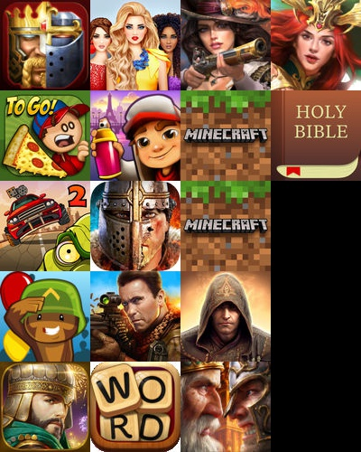
  </kbd>
  <kbd>
    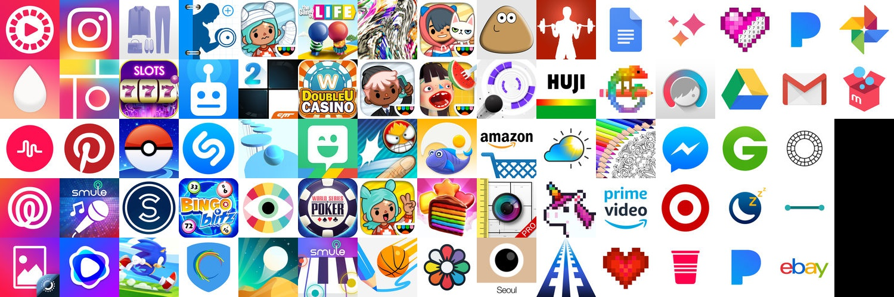
  </kbd>
  <kbd>
    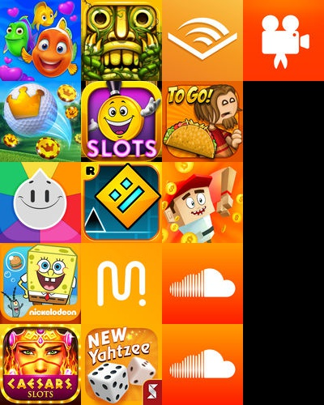
  </kbd>
  <kbd>
    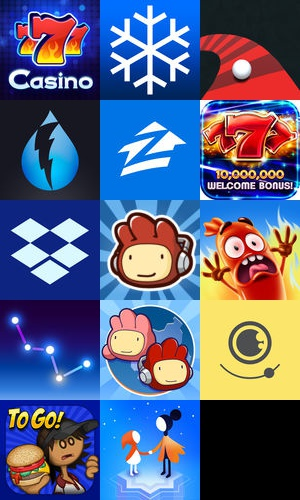
  </kbd>

