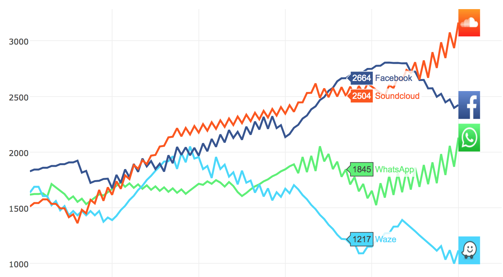

# iPhone App Icons

  <kbd>
    
  </kbd>

Repo for playing around with App Store app icons. Current scripts in repo:

### Output producing scripts

* [`download_top_chart_icons.py`](/download_top_chart_icons.py): script to download top chart app icons ([output in icons dir](/icons))
* [`sort_icons_by_color.py`](/sort_icons_by_color.py): sort app icons by hsv color space ([output shown above](#iphone-app-icons))
* [`demo_dominant_color.py`](/demo_dominant_color.py): takes an input image and displays the image's dominant color at different levels of k ([output shown below](#dominant-color-examples))
* [`search.py`](/search.py): a mini image search engine; use chi-square distance to compare image features to a given query and return the top n most related results  ([output shown below](#search-output-highlights))
* [`icon_cluster_color_bovw_kmeans.py`](/icon_cluster_color_bovw_kmeans.py): use k means to cluster app icons by colors and/or keypoint features in the form of a bag of visual words  ([output shown below](#cluster-output-highlights))
* [`dominant_color_plot.py`](/dominant_color_plot.py): a plot showing how dominant colors of app icons might be useful for user experience reporting ([output shown below](#who-cares))

### Feature generation scripts ([output in features_output dir](/features_output))

* [`create_bovw_features.py`](/create_bovw_features.py): use GFTT and RootSIFT to generate keypoint features for each icon, cluster the keypoints into a visual vocabularly, and apply vocab to the icons to create bag of visual word features
* [`create_color_features.py`](/create_color_features.py): use color histograms to generate color features for each icon
* [`create_imagenet_features.py`](/create_imagenet_features.py): use pretrained resnet50 model from keras with imagenet weights to generate features for each icon

## Dominant color examples

The image at the top of the readme shows apps sorted by their dominant color.  A good guess of how to find an image's dominant color might be to take the average of all the pixels' colors in the image.  It turns out that this isn't very representative of an image consistenting of more than one hue.  To find an image's dominant color we can perform k means to cluster the pixel colors and then take the centroid value of the largest cluster.  This technique can be extened to create a color palette with n colors from an image; to do this we just take n of our k centroids.

Note: The right value of k will hinge on the images you're working with, for app icons a setting k = 3 seems to perform well.

*Additional note on color: Images are typically stored in the [RGB colorspace](https://en.wikipedia.org/wiki/RGB_color_space), but the [HSV colorspace](https://en.wikipedia.org/wiki/HSV_color_space) relates more to how we perceive color. Because of this difference, all the dominant color calculations in this repo have been done in the HSV color space.*

  <table width="500" border="0" cellpadding="5">
    <tr>
        <td align="center" valign="center">
            
             
            k = 1 (average color)
        </td>
        <td align="center" valign="center">
            
             
            k = 3
        </td>
    </tr>
</table>

  <table width="500" border="0" cellpadding="5">
    <tr>
        <td align="center" valign="center">
            
             
            k = 1 (average color)
        </td>
        <td align="center" valign="center">
            
             
            k = 2
        </td>
    </tr>
</table>

### Who cares?

One possible application of this dominant color extraction is for use in plots.  A user who is familiar with a popular app will recognize its color in a plot and this could help make the user experience simpler.  An example plot with fake data shows this concept below.

The plot avoids the issue of apps having similiar/identical dominant colors.  A strategy of using secondary colors and/or adjusting colors to be disimilar could likely a strategy to deal with these issues when they come up.

  <kbd>
    
  </kbd>

**************

## Search output highlights

The main query image to be used in search engine examples will be the ['Toca Life: City'](https://itunes.apple.com/us/app/toca-life-city/id988318940?mt=8) icon.  There were a lot of apps by [Toca Boca AB](https://itunes.apple.com/us/developer/toca-boca-ab/id419103351?mt=8) in the top charts when the icons were scraped, and they all have similar artwork.  An ideal search engine would return all Toca Boca apps first when we search for icons similar to 'Toca Life: City'.

### Using only keypoint features

The search using only bag of visual word (BOVW) features performs fairly well, we found 2 of the other Toca Boca apps in the top 5 results.  The introduction of color features would likely weed out the ['Yu-Gi-Oh! Duel Links'](https://itunes.apple.com/us/app/yu-gi-oh-duel-links/id1068378177?mt=8) result.

Notice that we also return the query image itself with a dist of 0; this is an uninteresting result, but it reassures us that our distance metric is doing what we mean it to.

  <kbd>
    
  </kbd>

### Using only color features

The search using only color features performs arguably better than the BOVW only search.  Again we found 2 of the other Toca Boca apps, but this time they are the first 2 icons proposed.  It is of note that ['Toca Life: Hospital'](https://itunes.apple.com/us/app/toca-life-hospital/id1156114278?mt=8) stayed in our top results; this icon is so similar to our query icon that it is returned no matter which feature set we used.  Despite keeping 'Toca Life: Hospital', we lost our other Toca Boca result when we dropped the BOVW features.

  <kbd>
    
  </kbd>

### Using keypoint and color features

The search using both color and BOVW features performs as well as we could have hoped.  All of our top 5 results are apps from the Toca Boca family.

[Candy Crush](https://itunes.apple.com/us/app/candy-crush-saga/id553834731?mt=8) is another good group of apps to test our engine out on.  Searching with [Candy Crush Jelly Saga](https://itunes.apple.com/us/app/candy-crush-jelly-saga/id1047246341?mt=8) shows another great result.

*Note: other icon queries produce interesting results using this engine, but these examples were shown since they're rare cases where they have arguably 'right' results due to them being in such popular 'families' of apps at the time the icons were scraped.*

  <kbd>
    
  </kbd>
   &nbsp;&nbsp;&nbsp;&nbsp;
  <kbd>
    
  </kbd>

### Using deeplearned features (late addition)

An additional set of features was introduced to evaluate in this search setting.  Features were generated using the [keras resnet50](https://keras.io/applications/#resnet50) model that comes with pretrained weights produced with imagenet.  These features did not perform as well as BOVW + color features on the Toca Boca test.  However, these features performed exceptionally well in some cases as seen below the Toca Boca result.

There were attempts to use these deeplearned features with the BOVW + color features, but due to the high number of resnet features produced (2048) they dominate the search.  Dimension reduction strategies (TSNE & PCA) were looked into to fix this issue, but the reduction in dimensions resulted in a huge loss in perceived performance.

  <kbd>
    
  </kbd>

  <kbd>
    
  </kbd>
   &nbsp;&nbsp;&nbsp;&nbsp;
  <kbd>
    
  </kbd>

******************

## Cluster output highlights

*Note these results are from various levels of k when applying k means to the icons.  The clustering was just for exploration as opposed to optimizing some level of k that yielded the best results.*

### Using only keypoint features

Below are 2 results from clustering using only the keypoint features (while ignoring color features).  You can see the focus on similar shapes/patterns that appear in the icons.  On the left we can see the [Tidal](https://itunes.apple.com/us/app/tidal/id913943275?mt=8) & [Dropbox](https://itunes.apple.com/us/app/dropbox/id327630330?mt=8) logo designs focus on repeating diamond patterns.  On the left we can see similiarities in the sharp corners, a human-ish body, and the 'stars' in the top of the icons.

  <kbd>
    
  </kbd>
  &nbsp;&nbsp;&nbsp;&nbsp;
  <kbd>
    
  </kbd>

### Using only color features

Below are 2 results from clustering using only the color features (while ignoring keypoint features).  Interestingly, the icons in the cluster on the left show a very similar art style (for the most part) in addition to their similar colors that caused them to be grouped together.

  <kbd>
    
  </kbd>
  &nbsp;&nbsp;&nbsp;&nbsp;
  <kbd>
    
  </kbd>

### Using keypoint and color features

Below are 2 results from clustering using both BOVW and color features.  The result on the right is especially interesting since our features were able to match two apps showing the word 'SLOTS' without the use of [OCR](https://en.wikipedia.org/wiki/Optical_character_recognition).  The result on the left seems to be driven mostly by color features.

  <kbd>
    
  </kbd>
  &nbsp;&nbsp;&nbsp;&nbsp;
  <kbd>
    
  </kbd>

