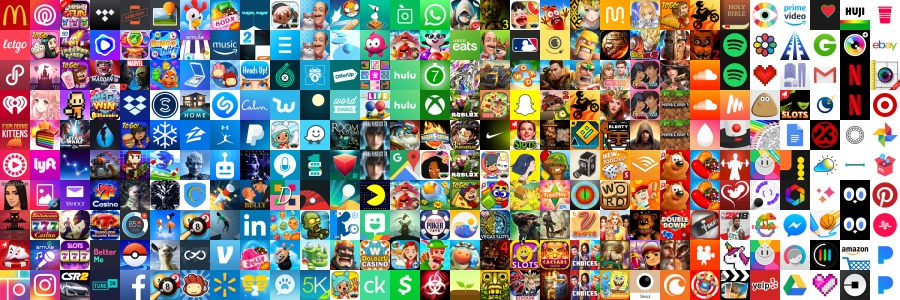

# iPhone App Icons

  <kbd>
    
  </kbd>

Repo for playing around with App Store app icons. Current scripts in repo:

* [`download_top_chart_icons.py`](/download_top_chart_icons.py): script to download top chart app icons ([output in icons dir](/icons))
* [`sort_icons_by_color.py`](/sort_icons_by_color.py): sort app icons by hsv color space ([output shown above](#iphone-app-icons))
* [`demo_dominant_color.py`](/demo_dominant_color.py): takes an input image and displays the image's dominant color at different levels of k ([output shown below](#dominant-color-examples))
* [`icon_cluster_color_bovw_kmeans.py`](/icon_cluster_color_bovw_kmeans.py): use k means to cluster app icons by colors and/or keypoint features in the form of a bag of visual words  ([output shown below](#cluster-output-highlights))
* [`create_bovw_features.py`](/create_bovw_features.py): use GFTT and RootSIFT to generate keypoint features for each icon, cluster the keypoints into a visual vocabularly, and apply vocab to the icons to create bag of visual word features ([output in features_output dir](/features_output))

## Dominant color examples

The image at the top of the readme shows apps sorted by their dominant color.  A good guess of how to find an image's dominant color might be to take the average of all the pixels' colors in the image.  It turns out that this isn't very representative of an image consistenting of more than hue.  To find an image's dominant color we can perform k means to cluster the pixel colors and then take the centroid value of the largest cluster.  The right value of k will hinge on the images you're working with, for app icons a setting k = 3 seems to perform well.

*An additional note on dominant color: Images are typically stored in the [RGB colorspace](https://en.wikipedia.org/wiki/RGB_color_space), but the [HSV colorspace](https://en.wikipedia.org/wiki/HSV_color_space) relates more to how we perceive color. Because of this difference, all the dominant color calculations in this repo have been done in the HSV color space.*

  <table width="500" border="0" cellpadding="5">
    <tr>
        <td align="center" valign="center">
            
             
            k = 1 (average color)
        </td>
        <td align="center" valign="center">
            
             
            k = 3
        </td>
    </tr>
</table>

  <table width="500" border="0" cellpadding="5">
    <tr>
        <td align="center" valign="center">
            
             
            k = 1 (average color)
        </td>
        <td align="center" valign="center">
            
             
            k = 2
        </td>
    </tr>
</table>

## Cluster output highlights

### Using only keypoint features

Below are 2 results from clustering using only the keypoint features (while ignoring color features).  You can see the focus on similar shapes/patterns that appear in the icons.  On the left we can see the Tidal & Dropbox logo designs focus on repeating diamond patterns.  On the left we can see similiarities in the sharp corners below a human-ish body and the 'stars' in the top of the icons.

  <kbd>
    
  </kbd>
  &nbsp;&nbsp;&nbsp;&nbsp;
  <kbd>
    
  </kbd>

### Using only color features

Below are 2 results from clustering using only the color features (while ignoring keypoint features).  Interestingly, the icons in the cluster on the left show a very similar art style (for the most part) in addition to their similar colors that caused them to be grouped together.

  <kbd>
    
  </kbd>
  &nbsp;&nbsp;&nbsp;&nbsp;
  <kbd>
    
  </kbd>

### Using keypoint and color features

Below are 2 results from clustering using both the keypoint and color features.  The result on the right is a little boring since it has 2 of the same icon, but this is reassuring that our clustering is keeping together identical images; if these we're in separate clusters we would have a problem in our features.

  <kbd>
    
  </kbd>
  &nbsp;&nbsp;&nbsp;&nbsp;
  <kbd>
    
  </kbd>

